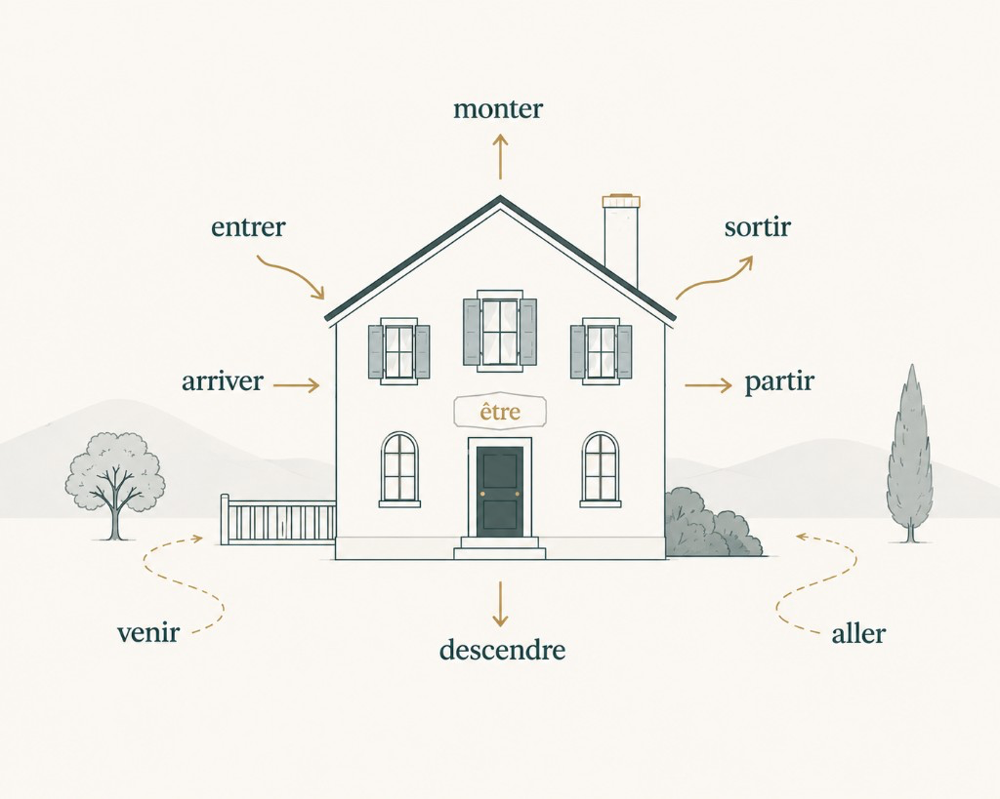

# Passé composé with *avoir* and *être*

When you talk about a finished past event in everyday French, you often use the *passé composé*: a helper verb plus a past participle.

Most verbs take *avoir* as that helper: *j'ai mangé*, *tu as parlé*, *nous avons pris le bus*. A smaller group takes *être*: *je suis allé*, *elle est arrivée*.

The useful skill at [A1](/en/cefr/) is hearing which helper belongs. Start with *avoir* as the default. Then learn the *être* set well enough that *j'ai arrivé* and *j'ai allé* start to sound wrong.

For the verbs themselves, see [Avoir - basics](/en/learn-french/votw/avoir/votw-avoir-basics-a1/) and [Être - basics](/en/learn-french/votw/etre/votw-etre-basics-a1/).

## Start with *avoir*

Build the past with a present form of *avoir* plus a past participle.

| French | English |
|--------|---------|
| J'ai mangé. | I ate. / I have eaten. |
| Tu as parlé. | You spoke. / You have spoken. |
| Elle a pris le bus. | She took the bus. |
| Nous avons regardé un film. | We watched a film. |

That is the pattern you will use most often. If you are unsure, *avoir* is the safer first guess for many common verbs (*manger*, *parler*, *finir*, *prendre*, *faire*, *avoir*, *être* as *j'ai été*).

## Then learn the *être* house set

A lot of the *être* verbs describe movement around a place: toward it, away from it, in, out, up, or down. A house makes that set easier to hold in mind.

The picture is a memory aid for eight high-frequency verbs: *aller*, *venir*, *arriver*, *partir*, *entrer*, *sortir*, *monter*, *descendre*. These are often called verbs of movement.

| French | English |
|--------|---------|
| Je suis allé au marché. | I went to the market. |
| Elle est arrivée à huit heures. | She arrived at eight o'clock. |
| Nous sommes entrés dans la maison. | We went into the house. |
| Ils sont partis tôt. | They left early. |

## A few more *être* verbs to add next

After the house set feels steady, add these. They also usually take *être*, even when the meaning is less about walking through a door: *rester*, *tomber*, *retourner*, *rentrer*, *revenir*, *devenir*, *naître*, *mourir*.

| French | English |
|--------|---------|
| Je suis resté à la maison. | I stayed at home. |
| Elle est tombée. | She fell. |
| Il est devenu médecin. | He became a doctor. |
| Je suis né en 2001. | I was born in 2001. |

You do not need a complete inventory on day one. Get the house verbs solid, then grow the list.

## Hear the agreement with *être*

With *être*, the past participle usually matches the subject. Train your eye and ear on the ending, not on a full agreement lecture.

| French | English |
|--------|---------|
| Il est arrivé. | He arrived. |
| Elle est arrivée. | She arrived. |
| Elles sont arrivées. | They arrived. |

With *avoir*, you can ignore agreement for now in basic A1 lines. Focus first on choosing the right helper.

## One trap: moving an object

Some house verbs take *avoir* when there is a direct object. Someone is moving a thing, not only moving themselves.

| French | English |
|--------|---------|
| Je suis sorti. | I went out. |
| J'ai sorti la poubelle. | I took the trash out. |
| Elle est montée. | She went upstairs. |
| Elle a monté la valise. | She carried the suitcase up. |

For the usual no-object sense, stay with *être*. When an object is in the sentence, *avoir* can be the right helper.

## Fix the forms that sound off

These mistakes usually come from English "I have…" landing on *avoir* by habit, or from missing agreement after *être*.

| Incorrect | Correct |
|-----------|---------|
| *J'ai arrivé hier.* | *Je suis arrivé hier.* |
| *Elle a allé au cinéma.* | *Elle est allée au cinéma.* |
| *Nous avons partis à midi.* | *Nous sommes partis à midi.* |
| *Elle est arrivé.* | *Elle est arrivée.* |

Say the correct column out loud. Then say the incorrect one again. The goal is for the wrong helper to feel strange.

## Before you go

Treat *avoir* as the default past helper. Use the house map for the common *être* motion set, then add the extra verbs when you are ready. Watch agreement after *être*, and watch the object trap with *sortir* and *monter*.

For more on individual verbs from the *être* set, see the lessons on [*arriver*](/en/learn-french/votw/votw-arriver-a2/) and [*tomber*](/en/learn-french/votw/votw-tomber-a2/).
